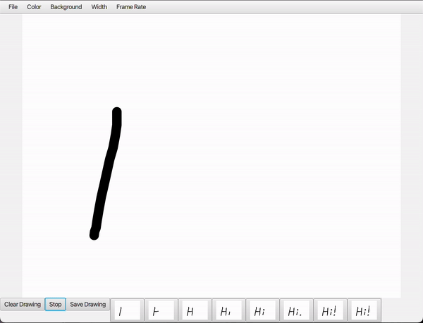

# JavaFX-Animation-Studio

A simple animation studio built in JavaFX 14. Created by Nnamdi Obi, Aarav Mehta, and Cliff McGinnis for NCSSM's "Advanced Java" course.

## Getting Started
With JavaFX Installed, update the [`compile.sh`](compile.sh) script with your system's path to the JavaFX SDK and then run it.

## How it works

### Drawings
Use your cursor to draw on the main canvas. You can edit the drawing options (pen color, canvas background color, pen size) using the top menubar.

Use the "Save Drawing" button to define a frame of the animation. As soon as you save the drawing, all other pen strokes now modify the new (unsaved) drawing. You can see all your saved drawings by looking at the buttons at the bottom of the menubar. By clicking the corresponding menubar button, you can load its saved drawing.

When clicking on a saved drawing, it will be loaded into the main canvas and you can edit it. After editing the drawing, you can then click the last saved drawing and click "save drawing" from there to work with a new frame.

You can erase your current drawing by clicking the "Clear Drawing" button.

### Animating
Each frame of the drawing is played at the set frame rate (default 1 frame per second).

Click the play button to play the saved animation, and click the stop button to pause the animation.

### Saving and Importing
You can save and import your current drawing/animation by using the menu.

Some sample animations are included in [`sample_animations`](sample_animations).